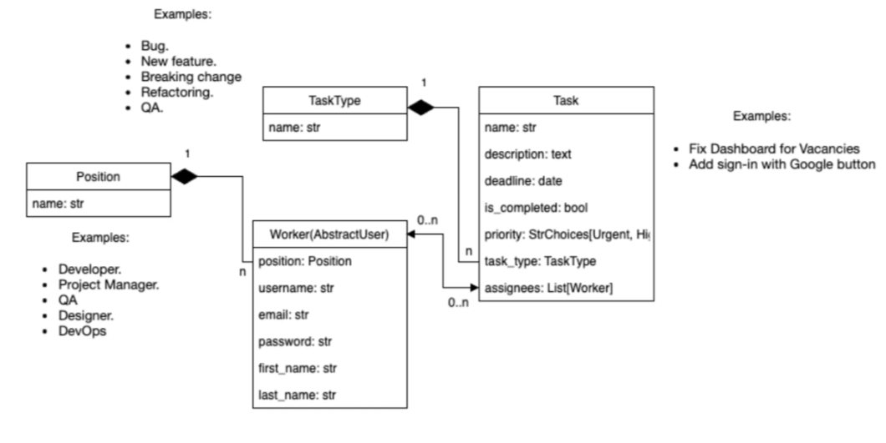

# 💻 IT Company Task Manager

A web application designed for tracking tasks, organizing team workload, and managing roles within an IT company, built with **Django** and styled with **Bootstrap 5**.

---

## 📌 Project Overview

### 🎯 Topic
An internal task management and team collaboration system for an IT company (Task Tracking & Team Management System).

### 🚀 Purpose & Goal
To provide a clean, reliable, and user-friendly platform for developers and project managers to:
* Categorize and prioritize tasks by urgency and technical type.
* Assign tasks to individual developers or multi-disciplinary teams.
* Monitor deadlines and task completion status in real-time.
* Manage company positions, worker profiles, and role assignments.

---

## 🛠 Technologies Used

* **Backend:**
  * [Python 3.12+](https://www.python.org/)
  * [Django 6.1+](https://www.djangoproject.com/) — High-level Python web framework
  * [Django Crispy Forms](https://django-crispy-forms.readthedocs.io/) & [Crispy Bootstrap 5](https://github.com/django-crispy-forms/crispy-bootstrap5) — Elegant form rendering with Bootstrap 5
  * [Django Debug Toolbar](https://django-debug-toolbar.readthedocs.io/) — Performance profiling and query optimization
* **Database:**
  * [SQLite](https://www.sqlite.org/) (used by default for local development, easily configurable for PostgreSQL)
* **Frontend:**
  * [Bootstrap 5.3](https://getbootstrap.com/) — Responsive CSS/JS framework
  * [Bootstrap Icons](https://icons.getbootstrap.com/) — Modern vector icon library
  * [Plus Jakarta Sans](https://fonts.google.com/specimen/Plus+Jakarta+Sans) — Modern typography (Google Fonts)
  * Custom CSS stylesheet ([`styles.css`](static/css/styles.css))

---

## 🗄️ Database Structure

The relationship between the system entities is illustrated below:



### 📊 Entity Descriptions

1. **`Position`**:
   * Represents job roles within the company (`Developer`, `QA`, `Project Manager`, `DevOps`, `Designer`, etc.).
   * `name`: Unique name of the position.
2. **`TaskType`**:
   * Categorizes work items (`New Feature`, `Bug`, `Refactoring`, `Breaking change`, `QA`).
   * `name`: Name of the task type.
3. **`Worker`**:
   * Extends Django's `AbstractUser` model.
   * Standard user attributes: `username`, `first_name`, `last_name`, `email`, `password`.
   * `position`: Foreign key (`ForeignKey`) referencing the `Position` model (Many-to-One).
4. **`Task`**:
   * Core work unit with `name`, `description`, `deadline`, and `is_completed` fields.
   * `priority`: Choices between `Urgent`, `High`, `Medium`, and `Low`.
   * `task_type`: Foreign key (`ForeignKey`) referencing `TaskType` (Many-to-One).
   * `assignees`: Many-to-Many relationship with `Worker` (tasks can have multiple assignees).

---

## 🏛️ Project Architecture

The project follows Django's standard **MTV (Model - Template - View)** pattern:

```text
IT-Company-task-manager/
├── IT_company_task_manager/      # Main project configuration
│   ├── __init__.py
│   ├── asgi.py
│   ├── settings.py              # Application settings (installed apps, DB, auth)
│   ├── urls.py                  # Root URL configuration
│   └── wsgi.py
├── tasks/                       # Core task management application
│   ├── migrations/              # Database migration history
│   ├── admin.py                 # Admin site registrations
│   ├── apps.py                  # Application configuration
│   ├── forms.py                 # Forms for validation and filtering
│   ├── models.py                # Database models (Task, Worker, Position, TaskType)
│   ├── tests.py                 # Test cases
│   ├── urls.py                  # App-specific URL routes
│   └── views.py                 # Class-Based Views for CRUD operations
├── templates/                   # HTML templates
│   ├── base.html                # Base layout with sidebar and asset links
│   ├── includes/                # Reusable partials (sidebar, pagination)
│   ├── registration/            # Authentication templates (login, logged_out)
│   └── tasks/                   # Views for tasks, workers, positions, task types
├── static/                      # Static assets
│   └── css/
│       └── styles.css           # Custom styling and color scheme
├── .gitignore                   # Git ignore file
├── requirements.txt             # Python dependencies
└── manage.py                    # Django management script
```

### 🔑 Key Architectural Highlights:
* **Class-Based Views (CBVs):** All CRUD workflows utilize Django's `ListView`, `DetailView`, `CreateView`, `UpdateView`, and `DeleteView`.
* **Access Control:** Protected views enforce authentication using `LoginRequiredMixin` and `@login_required`.
* **Query Optimization:** Efficient database querying utilizing `select_related` for ForeignKeys (`task_type`, `position`) and `prefetch_related` for ManyToMany relationships (`assignees`, `assigned_tasks`) to eliminate N+1 query bottlenecks.

---

## ⚡ Local Setup & Installation Guide

### 1. Clone the repository
```bash
git clone https://github.com/vovikLXUS/IT-Company-task-manager.git
cd IT-Company-task-manager
```

### 2. Create and activate a virtual environment

* **Windows:**
  ```bash
  python -m venv .venv
  .venv\Scripts\activate
  ```

* **Linux / macOS:**
  ```bash
  python3 -m venv .venv
  source .venv/bin/activate
  ```

### 3. Install required dependencies
```bash
pip install -r requirements.txt
```

### 4. Run database migrations
```bash
python manage.py migrate
```

### 5. Create a superuser (Administrator)
```bash
python manage.py createsuperuser
```
*(Follow the prompt to provide a `username`, `email`, and `password`).*

### 6. Start the development server
```bash
python manage.py runserver
```

Once running, access the application in your browser:
👉 **[http://127.0.0.1:8000/](http://127.0.0.1:8000/)**

The Django Admin panel is accessible at:
👉 **[http://127.0.0.1:8000/admin/](http://127.0.0.1:8000/admin/)**
