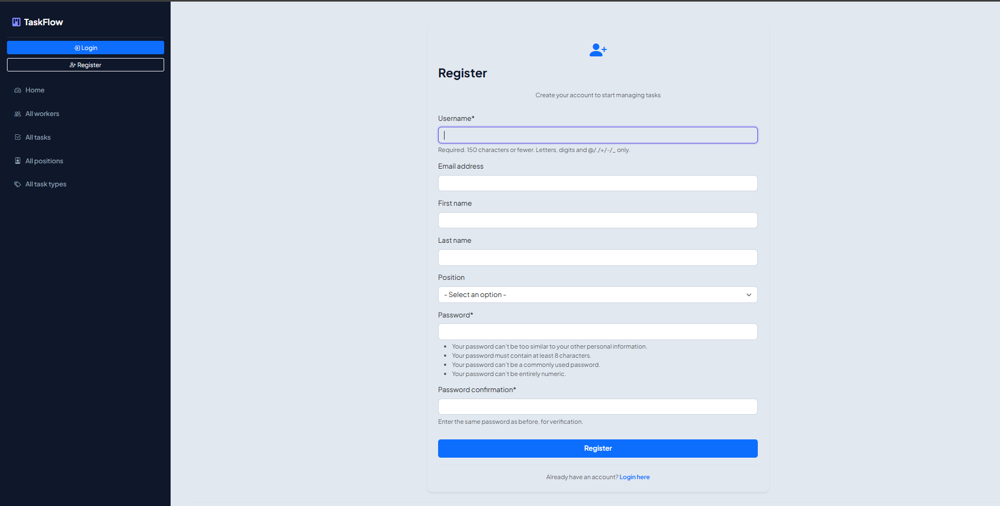
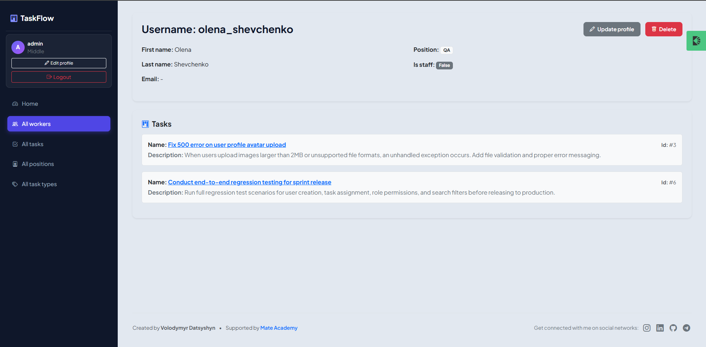
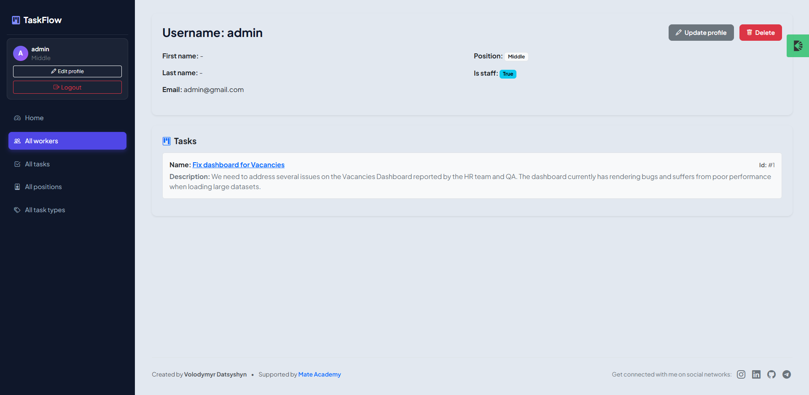
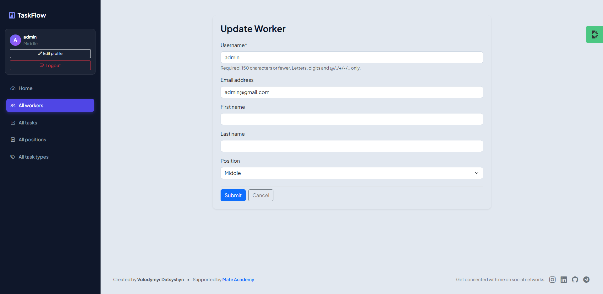
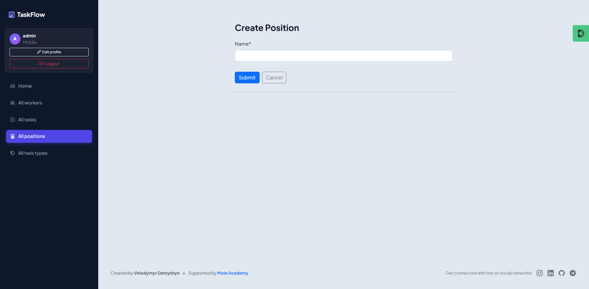
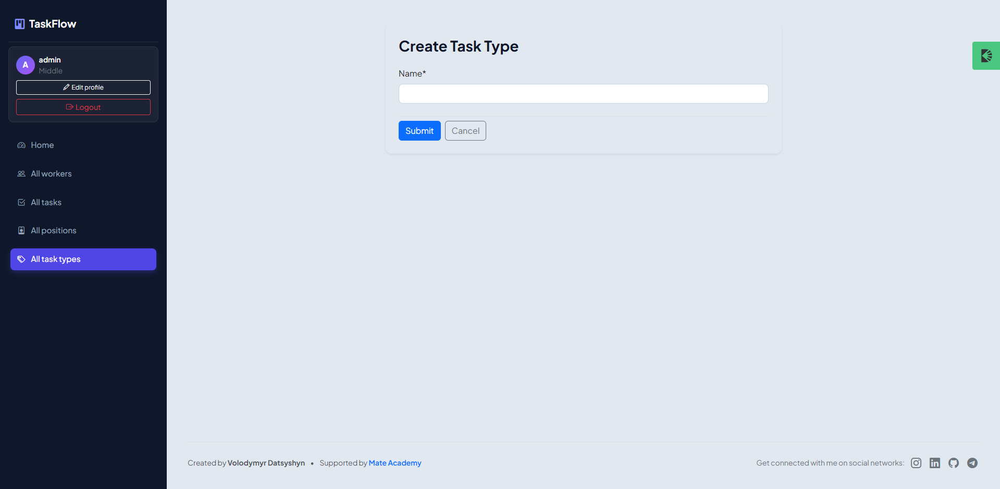

# 💻 IT Company Task Manager

A web application designed for tracking tasks, organizing team workload, and managing roles within an IT company, built with **Django** and styled with **Bootstrap 5**.

🚀 **Live Production Demo:** [https://it-company-task-manager-v9cq.onrender.com/](https://it-company-task-manager-v9cq.onrender.com/)

[](https://it-company-task-manager-v9cq.onrender.com/)
[](https://www.python.org/)
[](https://www.djangoproject.com/)
[](https://neon.tech/)
[](https://getbootstrap.com/)

---

## 📌 Project Overview

### 🎯 Topic
An internal task management and team collaboration system for an IT company (Task Tracking & Team Management System).

### 🚀 Purpose & Goal
To provide a clean, reliable, and user-friendly platform for developers and project managers to:
* Categorize and prioritize tasks by urgency and technical type.
* Assign tasks to individual developers or multi-disciplinary teams.
* Monitor deadlines and task completion status in real-time.
* Manage company positions, worker profiles, and role assignments.
* Securely authenticate and register team members with granular permission controls.

---

## ✨ Features & Capabilities

### 🔐 Authentication & Accounts
* **User Registration:** Simple, intuitive registration with `username`, `email`, `first_name`, `last_name`, and company `position`. Automatically signs the new user in upon registration.
* **Dual-mode Login:** Seamless login via **either username or email address** (case-insensitive) using a custom authentication backend (`EmailOrUsernameModelBackend`).
* **Session Management:** Secure login, logout, and session-based page visit counter.

### 👤 Profile & Worker Management
* **Worker Profiles:** Detailed profile views with personal info and active assigned tasks.
* **Granular Profile Updates:** Workers can update all their personal details (`username`, `email`, `first_name`, `last_name`, `position`).
* **Role-Based Access Control:** Strict permission check powered by `UserPassesTestMixin` — workers can only update their own profile, whereas administrators (`is_staff` / superusers) can update any worker.
* **Team Directory:** Paginated list of all team members with username search and role badges (technical administrators/superusers are automatically filtered out to present a clean team roster).

### 📋 Task Management
* **Task Catalog & Search:** Paginated overview of all tasks with real-time name search filtering.
* **Task Details & Direct Toggle:** Dedicated task view displaying urgency badges, deadlines, assignees, and a one-click button to self-assign or unassign from the task.
* **Complete Task CRUD:** Create, read, update, and delete tasks with multiple assignee selection (technical administrators are excluded from assignee options to allocate work strictly to actual workers).

### 🏷️ Positions & Task Types
* **Positions Management:** Manage job roles (`Developer`, `QA`, `Project Manager`, `DevOps`, `Designer`, etc.) with search and full CRUD operations.
* **Task Types Management:** Organize work items by category (`New Feature`, `Bug`, `Refactoring`, `QA`, etc.) with search and full CRUD operations.

### 🎨 Modern UI & Global Navigation
* **Quick Repo Link:** Header on the home page features a direct GitHub repository shortcut opposite to the main title.
* **Collapsible / Fixed Sidebar:** Displays user avatar, active status, quick "Edit profile" button, navigation links, and logout trigger.
* **Global Footer:** Modern footer on all pages featuring social media links (Instagram, LinkedIn, GitHub, Telegram), author attribution (*"Created by Volodymyr Datsyshyn"*), and educational support link (*"Supported by Mate Academy"*).

---

## 📸 Demo

### 🔐 Authentication
* **Login Page (Username or Email):**
  

* **Register Page:**
  

### 🏠 Dashboard
* **Home Page with Statistics, GitHub Repo Link & Global Footer:**
  

### 📋 Task Management
* **Tasks List & Filtering:**
  

* **Create Task:**
  

### 👥 Team & Worker Management
* **Workers List:**
  

* **Worker Profile & Assigned Tasks:**
  

* **Current User Profile View:**
  

* **Update Profile Page (Full Field Editing with Permissions):**
  

* **Create Worker (Admin / Staff Workflow):**
  

### 🏷️ Positions & Task Types
* **Positions List:**
  

* **Create Position:**
  

* **Task Types List:**
  

* **Create Task Type:**
  

---

## 🛠 Technologies Used

* **Backend:**
  * [Python 3.12+](https://www.python.org/)
  * [Django 6.1+](https://www.djangoproject.com/) — High-level Python web framework
  * [Gunicorn 26.2+](https://gunicorn.org/) — High-performance WSGI HTTP Server for production
  * [Django Crispy Forms](https://django-crispy-forms.readthedocs.io/) & [Crispy Bootstrap 5](https://github.com/django-crispy-forms/crispy-bootstrap5) — Elegant form rendering with Bootstrap 5
  * [WhiteNoise](http://whitenoise.evans.io/) — Efficient static file serving directly from Django in production
  * [Django Debug Toolbar](https://django-debug-toolbar.readthedocs.io/) — Performance profiling and query optimization (development)
  * Custom Authentication Backend (`EmailOrUsernameModelBackend`) — Case-insensitive dual username/email authentication
* **Database & ORM:**
  * [PostgreSQL](https://www.postgresql.org/) (Serverless Postgres on [Neon](https://neon.tech/) with SSL connection for production)
  * [psycopg2-binary](https://www.psycopg.org/) — PostgreSQL database adapter for Python
  * [SQLite](https://www.sqlite.org/) (lightweight local development database)
* **Cloud & Hosting:**
  * [Render](https://render.com/) — Cloud platform hosting the live production web service
  * [Neon](https://neon.tech/) — Cloud serverless PostgreSQL database provider
* **Frontend:**
  * [Bootstrap 5.3](https://getbootstrap.com/) — Responsive CSS/JS framework
  * [Bootstrap Icons](https://icons.getbootstrap.com/) — Modern vector icon library
  * [Plus Jakarta Sans](https://fonts.google.com/specimen/Plus+Jakarta+Sans) — Modern typography (Google Fonts)
  * Custom CSS stylesheet ([`styles.css`](static/css/styles.css))
* **Code Quality & Testing:**
  * Automated Test Suite with **38 test cases** covering models, forms, views, auth, and permissions
  * [Flake8](https://flake8.pycqa.org/) — PEP 8 style guide enforcement
  * [Black](https://black.readthedocs.io/) — Python code formatter

---

## 🗄️ Database Structure

The relationship between the system entities is illustrated below:


### 📊 Entity Descriptions

1. **`Position`**:
   * Represents job roles within the company (`Developer`, `QA`, `Project Manager`, `DevOps`, `Designer`, etc.).
   * `name`: Unique name of the position.
2. **`TaskType`**:
   * Categorizes work items (`New Feature`, `Bug`, `Refactoring`, `Breaking change`, `QA`).
   * `name`: Name of the task type.
3. **`Worker`**:
   * Extends Django's `AbstractUser` model.
   * Attributes: `username`, `email`, `first_name`, `last_name`, `password`.
   * `position`: Foreign key (`ForeignKey`) referencing the `Position` model (Many-to-One).
4. **`Task`**:
   * Core work unit with `name`, `description`, `deadline`, and `is_completed` fields.
   * `priority`: Choices between `Urgent`, `High`, `Medium`, and `Low`.
   * `task_type`: Foreign key (`ForeignKey`) referencing `TaskType` (Many-to-One).
   * `assignees`: Many-to-Many relationship with `Worker` (tasks can have multiple assignees).

---

## 🏛️ Project Architecture

The project follows Django's standard **MTV (Model - Template - View)** pattern:

```text
IT-Company-task-manager/
├── assets/
│   ├── db_structure.png         # Database structure diagram
│   └── demo_photos/             # Application screenshots (14 pages)
│       ├── create_position_page.png
│       ├── create_task_page.png
│       ├── create_task_type_page.png
│       ├── create_worker_page.png
│       ├── home_page.png
│       ├── login_page.png
│       ├── positions_page.png
│       ├── register_page.png
│       ├── task_types_page.png
│       ├── tasks_page.png
│       ├── update_profile_page.png
│       ├── user_page.png
│       ├── worker_detailed_page.png
│       └── workers_page.png
├── IT_company_task_manager/     # Main project configuration
│   ├── settings/                
│   │   ├── __init__.py
│   │   ├── base.py              # Shared base settings (apps, auth backends, crispy)
│   │   ├── dev.py               # Development settings (SQLite, Debug Toolbar)
│   │   └── prod.py              # Production settings (PostgreSQL on Neon, WhiteNoise, HTTPS)
│   ├── __init__.py
│   ├── asgi.py          
│   ├── urls.py                  # Root URL configuration (login, register, admin)
│   └── wsgi.py                  # WSGI config for Gunicorn deployment
├── tasks/                       # Core task management application
│   ├── migrations/              # Database migration history
│   ├── admin.py                 # Admin site registrations
│   ├── apps.py                  # Application configuration
│   ├── backends.py              # Custom auth backend (username or email login)
│   ├── forms.py                 # Forms for validation, auth, and filtering
│   ├── models.py                # Database models (Task, Worker, Position, TaskType)
│   ├── tests/                   # Automated test suite (38 tests)
│   │   ├── test_admin.py
│   │   ├── test_forms.py
│   │   ├── test_models.py
│   │   └── test_views.py
│   ├── urls.py                  # App-specific URL routes
│   └── views.py                 # Class-Based Views for CRUD operations & auth
├── templates/                   # HTML templates
│   ├── base.html                # Base layout with sidebar, footer, and styles
│   ├── includes/                # Reusable partials
│   │   ├── footer.html          # Global footer with social links and credits
│   │   ├── pagination.html      # Pagination controls
│   │   └── sidebar.html         # Navigation sidebar with user card & edit profile
│   ├── registration/            # Authentication templates
│   │   ├── logged_out.html      # Logout confirmation
│   │   ├── login.html           # Login with username or email
│   │   └── register.html        # User registration form
│   └── tasks/                   # Views for tasks, workers, positions, task types
├── static/                      # Static assets
│   └── css/
│       └── styles.css           # Custom styling and color scheme
├── staticfiles/                 # Collected static assets
├── .gitignore                   # Git ignore file
├── build.sh                     # Build script for Render (pip, collectstatic, migrate)
├── dump.json                    # Initial database fixtures and demo dataset
├── requirements.txt             # Python dependencies
├── .env.example                 # Environment variables template
├── README.md                    # Project documentation
└── manage.py                    # Django management script
```

### 🔑 Key Architectural Highlights:
* **Multi-Environment Settings Architecture:** Clean modular architecture separating core settings (`base.py`), local development with SQLite and Django Debug Toolbar (`dev.py`), and production deployment with PostgreSQL on Neon, WhiteNoise, and SSL/HTTPS protection (`prod.py`).
* **Automated Cloud Deployment (Render & Neon):** Streamlined CI/CD deployment pipeline utilizing `build.sh` for dependency installation, static file collection, and database migrations, served via high-performance Gunicorn WSGI server.
* **Class-Based Views (CBVs):** All CRUD workflows utilize Django's `ListView`, `DetailView`, `CreateView`, `UpdateView`, and `DeleteView`.
* **Custom Authentication Backend:** `EmailOrUsernameModelBackend` enables users to authenticate using either their username or email address.
* **Access Control & Permissions:** Protected views enforce authentication with `LoginRequiredMixin`. `WorkerUpdateView` enforces role-based access via `UserPassesTestMixin`, guaranteeing that users can only modify their own profile while administrators retain full modification rights.
* **Query Optimization:** Efficient database querying utilizing `select_related` for ForeignKeys (`task_type`, `position`) and `prefetch_related` for ManyToMany relationships (`assignees`, `assigned_tasks`) to eliminate N+1 query bottlenecks.
* **Comprehensive Testing:** 38 automated unit and integration tests covering models, forms, access control, registration, and views.

---

## ⚡ Local Setup & Installation Guide

### 1. Clone the repository
```bash
git clone https://github.com/vovikLXUS/IT-Company-task-manager.git
cd IT-Company-task-manager
```

### 2. Create and activate a virtual environment

* **Windows:**
  ```bash
  python -m venv .venv
  .venv\Scripts\activate
  ```

* **Linux / macOS:**
  ```bash
  python3 -m venv .venv
  source .venv/bin/activate
  ```

### 3. Install required dependencies
```bash
pip install -r requirements.txt
```

### 4. Configure environment variables
Create a `.env` file from `.env.example` (or configure your own `SECRET_KEY` and `DEBUG`):
* **Windows (PowerShell):**
  ```powershell
  Copy-Item .env.example .env
  ```
* **Linux / macOS / Git Bash:**
  ```bash
  cp .env.example .env
  ```

### 5. Run database migrations
```bash
python manage.py migrate
```

### 6. Create a superuser (Administrator)
```bash
python manage.py createsuperuser
```
*(Follow the prompt to provide a `username`, `email`, and `password`).*

### 7. Run test suite
```bash
python manage.py test
```

### 8. Start the development server
```bash
python manage.py runserver
```

Once running, access the application in your browser:
👉 **[http://127.0.0.1:8000/](http://127.0.0.1:8000/)**

The Django Admin panel is accessible at:
👉 **[http://127.0.0.1:8000/admin/](http://127.0.0.1:8000/admin/)**

---

## 🚀 Production Deployment (Render & Neon)

The application is deployed on **Render** with a managed serverless **PostgreSQL** database on **Neon**.

🌐 **Live Application:** [https://it-company-task-manager-v9cq.onrender.com/](https://it-company-task-manager-v9cq.onrender.com/)

### 🛠️ Render Web Service Configuration

| Setting | Value |
| :--- | :--- |
| **Runtime** | Python |
| **Build Command** | `./build.sh` |
| **Start Command** | `gunicorn IT_company_task_manager.wsgi:application` |

### 🔑 Environment Variables on Render

| Variable | Description / Example |
| :--- | :--- |
| `DJANGO_SETTINGS_MODULE` | `IT_company_task_manager.settings.prod` |
| `SECRET_KEY` | Strong production secret key |
| `POSTGRES_DB` | PostgreSQL database name (e.g. `neondb`) |
| `POSTGRES_USER` | PostgreSQL username (e.g. `neondb_owner`) |
| `POSTGRES_PASSWORD` | PostgreSQL user password |
| `POSTGRES_HOST` | PostgreSQL host domain on Neon |
| `POSTGRES_DB_PORT` | `5432` |
| `RENDER_EXTERNAL_HOSTNAME` | Automatically supplied by Render (e.g. `it-company-task-manager-v9cq.onrender.com`) |

### 🗄️ Initial Data & Admin Setup on Production

**Load Demo Dataset (Optional):**
   Populate the production database with initial positions, task types, workers, and sample tasks:
   ```bash
   python manage.py loaddata dump.json --settings=IT_company_task_manager.settings.prod
   ```
